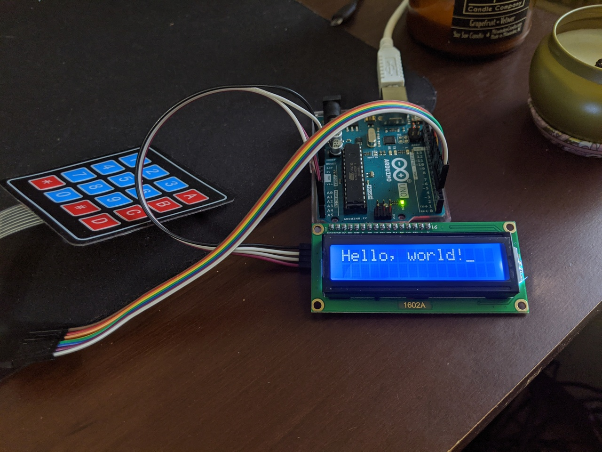

# Knitting counter

I made this simple knitting / T-counter using an Arduino Uno for my mother for Christmas.
My first small hardware/microcontroller project, in Rust!

Features:
  - 4 separate counter states
  - Incrementing & decrementing
  - Resetting
  - Ability to set a counter to arbitrary value (that fits in 16 bits)
  - Persisting state to Arduino EEPROM

I'm pleased with it overall, though the physical assembly could definitely be improved.
I was cutting it close on time and the pandemic made it difficult to get materials.

[YouTube recording of finished counter](https://youtu.be/NR5LklTTnRU)
